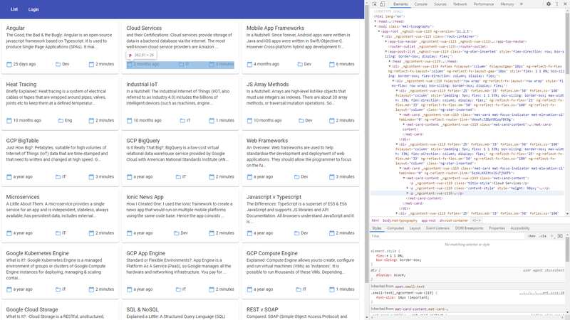

# :zap: Angular Firebase Access

* Angular app using Firebase tools to access a Google Cloud Firestore
* **Note:** to open web links in a new window use: _ctrl+click on link_


## :page_facing_up: Table of contents

* [:zap: Angular Firebase Access](#zap-angular-firebase-access)
  * [:page_facing_up: Table of contents](#page_facing_up-table-of-contents)
  * [:books: General info](#books-general-info)
  * [:camera: Screenshots](#camera-screenshots)
  * [:signal_strength: Technologies](#signal_strength-technologies)
  * [:floppy_disk: Setup](#floppy_disk-setup)
  * [:computer: Code Examples](#computer-code-examples)
  * [:cool: Features](#cool-features)
  * [:clipboard: Status & To-Do List](#clipboard-status--to-do-list)
  * [:clap: Inspiration](#clap-inspiration)
  * [:file_folder: License](#file_folder-license)
  * [:envelope: Contact](#envelope-contact)

## :books: General info

* Includes Firebase authentication to access posts database using a Google account but the login method can be changed in `services/auth.service.ts`

## :camera: Screenshots

* 

## :signal_strength: Technologies

* [Angular v12](https://angular.io/)
* [Firebase v8.2.6](https://firebase.google.com) Cloud storage and authentication. Note: error caused by latest version of Firebase@8.6.4 so older v8.2.6 used.
* [Firebase Tools v9](https://www.npmjs.com/package/firebase-tools) CLI used to manage a Firebase project
* [Angular/fire v6](https://www.npmjs.com/package/@angular/fire) Angular library for Firebase

## :floppy_disk: Setup

* Install dependencies using `npm i`
* Run `ng serve` for a dev server. Navigate to `http://localhost:4200/`. The app will automatically reload if you change any of the source files.
* Run `ng build` to build the project. The build artifacts will be stored in the `dist/` directory. Use the `--prod` flag for a production build.
* Run `ng update` to update Angular

## :computer: Code Examples

* functions from `post.service.ts` to get all posts and a specific post by id.

```typescript
  getPosts() {
    return this.postsCollection.snapshotChanges().pipe(
      map((actions) => {
        return actions.map((a) => {
          const data = a.payload.doc.data() as Post;
          const id = a.payload.doc.id;
          return { id, ...data };
        });
      })
    );
  }

  getPostData(id: string) {
    this.postDoc = this.afs.doc<Post>(`posts/${id}`);
    return this.postDoc.valueChanges();
  }
```

## :cool: Features

* Html template uses the [Angular async pipe](https://angular.io/api/common/AsyncPipe) to subscribe to the posts Observable and to unsubscribe automatically in the onDestroy lifecycle, avoiding memory leaks.

## :clipboard: Status & To-Do List

* Status: Working. Updated may 201. With a Google login it is possible to Create, Read, Update and Delete blog posts.
* To-Do: Use to update posts and images for website

## :clap: Inspiration

* [Blog post images from Unsplash](https://unsplash.com/)

## :file_folder: License

* This project is licensed under the terms of the MIT license.

## :envelope: Contact

* Repo created by [ABateman](https://github.com/AndrewJBateman), email: gomezbateman@yahoo.com
